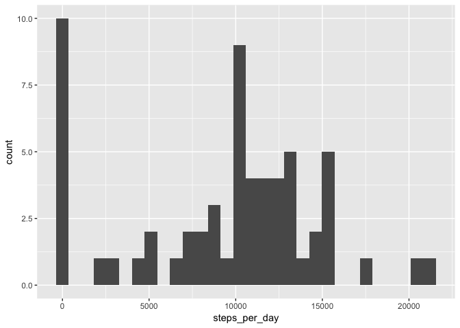
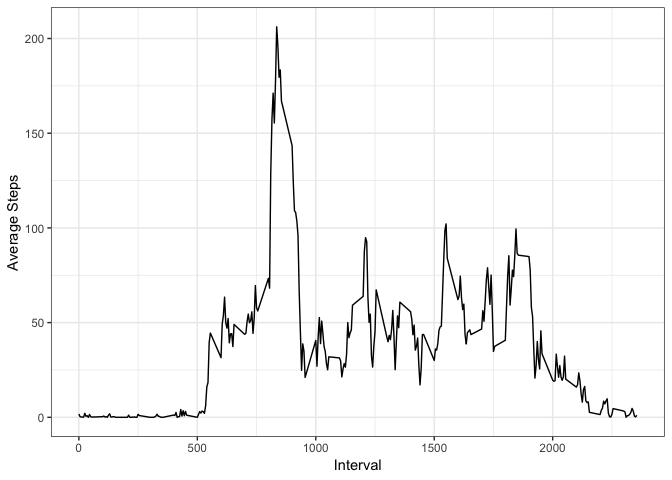
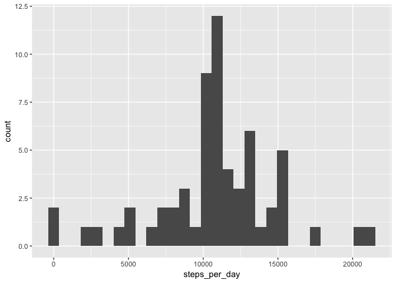
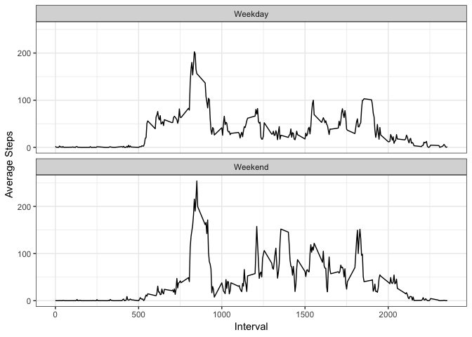

This is an R Markdown document for the Reproducible Research Peer-graded assignment: Course Project 1 

##Loading and preprocessing the data

1. Code for reading in the dataset and/or processing the data

```r
library(tidyverse)
```

```
## ── Attaching packages ──────────────────────────────────────────── tidyverse 1.2.1 ──
```

```
## ✔ ggplot2 3.0.0     ✔ purrr   0.2.5
## ✔ tibble  1.4.2     ✔ dplyr   0.7.6
## ✔ tidyr   0.8.1     ✔ stringr 1.3.1
## ✔ readr   1.1.1     ✔ forcats 0.3.0
```

```
## ── Conflicts ─────────────────────────────────────────────── tidyverse_conflicts() ──
## ✖ dplyr::filter() masks stats::filter()
## ✖ dplyr::lag()    masks stats::lag()
```

```r
url <- "https://d396qusza40orc.cloudfront.net/repdata%2Fdata%2Factivity.zip"
download.file(url, destfile = "zipped.zip")
data <- read_csv("zipped.zip")
```

```
## Parsed with column specification:
## cols(
##   steps = col_integer(),
##   date = col_date(format = ""),
##   interval = col_integer()
## )
```

##What is the mean total number of steps taken per day?

2. Histogram of the total number of steps taken each day

```r
steps <- ggplot(data, aes(steps)) + geom_histogram()
steps
```

```
## `stat_bin()` using `bins = 30`. Pick better value with `binwidth`.
```

```
## Warning: Removed 2304 rows containing non-finite values (stat_bin).
```

<!-- -->

3. Mean and median number of steps taken each day

The mean is:

```r
mean(data$steps, na.rm = TRUE)
```

```
## [1] 37.3826
```

The median is:

```r
median(data$steps, na.rm =TRUE)
```

```
## [1] 0
```

##What is the average daily activity pattern?

4. Time series plot of the average number of steps taken

```r
daily_aves <- (data %>% 
                group_by(interval) %>% 
                summarise(average_steps = mean(steps, na.rm = TRUE))
)

activity_pattern <- (ggplot(daily_aves, aes(interval, average_steps)) +
                        geom_line() +
                        labs(x = "Interval", y = "Average Steps") +
                        theme_bw()
)

activity_pattern
```

<!-- -->

5. The 5-minute interval that, on average, contains the maximum number of steps

```r
max_int <- daily_aves %>% top_n(n=1)
```

```
## Selecting by average_steps
```

```r
max_int
```

```
## # A tibble: 1 x 2
##   interval average_steps
##      <int>         <dbl>
## 1      835          206.
```

##Imputing missing values.

Calculate and report the total number of missing values in the dataset (i.e. the total number of rows with NAs)

```r
missing_rows <- sum(is.na(data$steps))
missing_rows
```

```
## [1] 2304
```

6. Code to describe and show a strategy for imputing missing data

Missing step values are imputed with the mean step value for the corresponding interval.

```r
imp_data <- (data %>% 
                inner_join(daily_aves, by = "interval") %>%
                     mutate(steps = ifelse(is.na(steps), average_steps, steps))
)
```

7. Histogram of the total number of steps taken each day after missing values are imputed

```r
imp_hist <- ggplot(imp_data, aes(steps)) + geom_histogram() 
imp_hist
```

```
## `stat_bin()` using `bins = 30`. Pick better value with `binwidth`.
```

<!-- -->

The mean steps steps per day including imputed data is:

```r
mean(imp_data$steps)
```

```
## [1] 37.3826
```

The median steps per day including imputed data is:

```r
median(imp_data$steps)
```

```
## [1] 0
```

These values do not differ from the estimates in the first part of the assignment.

## Are there differences in activity patterns between weekdays and weekends?


```r
library(lubridate)
```

```
## 
## Attaching package: 'lubridate'
```

```
## The following object is masked from 'package:base':
## 
##     date
```

```r
dates_data <- (imp_data %>% 
        mutate(day_type = ifelse(wday(date) >= 6, "Weekend", "Weekday")) %>%
        group_by(interval, day_type) %>%
        summarise(ave_steps = mean(steps))
)

day_plot <- (ggplot(dates_data, aes(interval, ave_steps)) +
                        geom_line() +
                        facet_wrap(~day_type, nrow = 2) +
                        labs(x = "Interval", y = "Average Steps") +
                        theme_bw()
)
day_plot
```

<!-- -->
